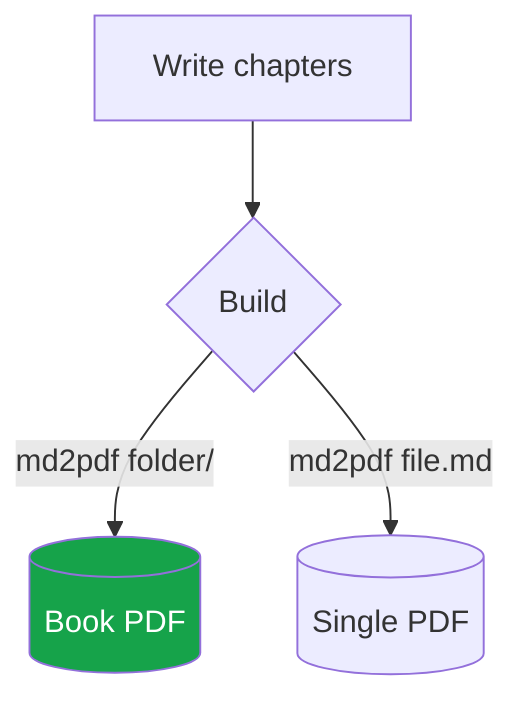
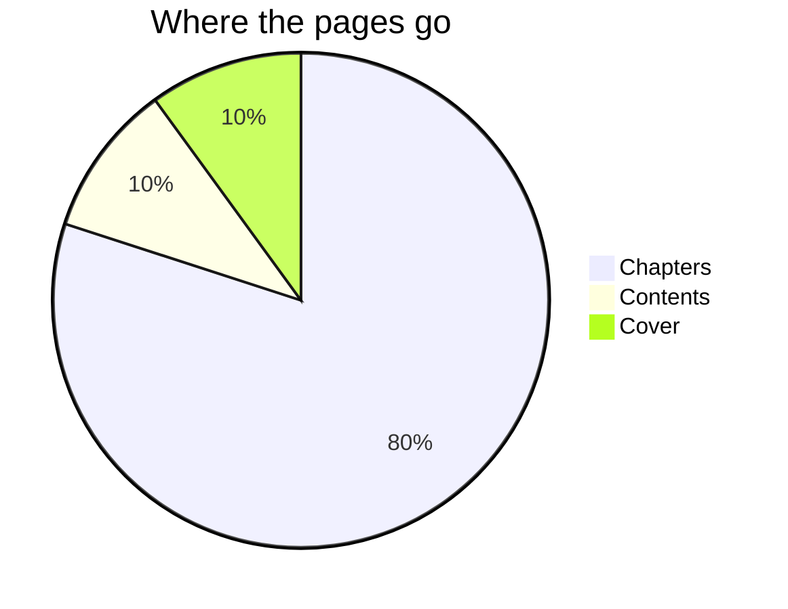
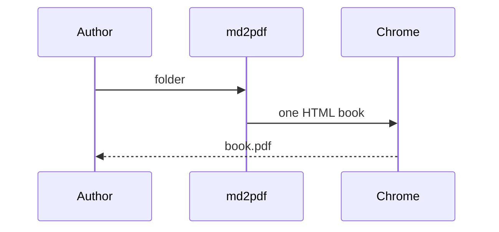

# Diagrams & Charts

Diagrams are written as Mermaid code blocks and drawn in theme colors.

## Gallery

```mermaid
flowchart TD
    W[Write chapters] --> B{Build}
    B -->|md2pdf folder/| P[(Book PDF)]
    B -->|md2pdf file.md| S[(Single PDF)]
    style P fill:#16a34a,color:#fff
```

```mermaid
pie title Where the pages go
    "Chapters" : 80
    "Contents" : 10
    "Cover" : 10
```

## Sequence

```mermaid
sequenceDiagram
    Author->>md2pdf: folder
    md2pdf->>Chrome: one HTML book
    Chrome-->>Author: book.pdf
```

Back to [Getting Started](01-getting-started.md#your-first-book).
